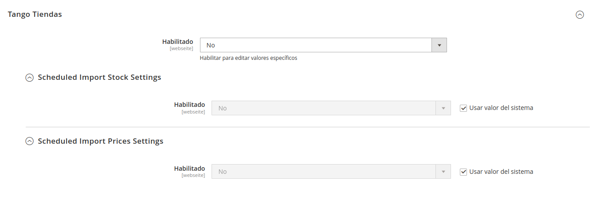
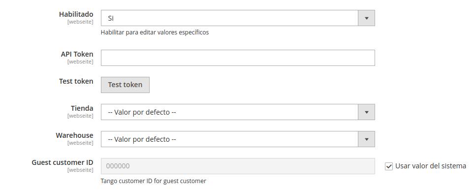
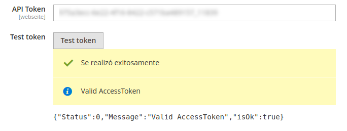
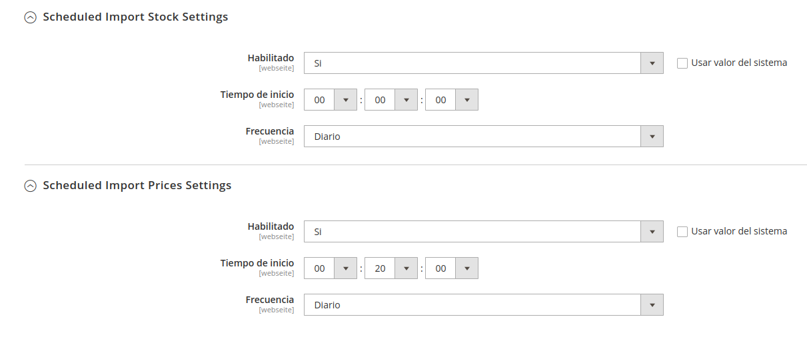
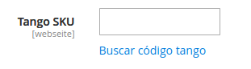
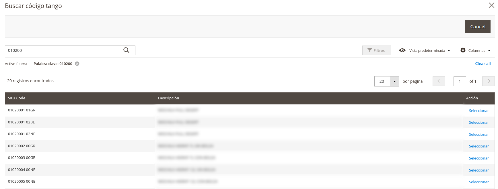
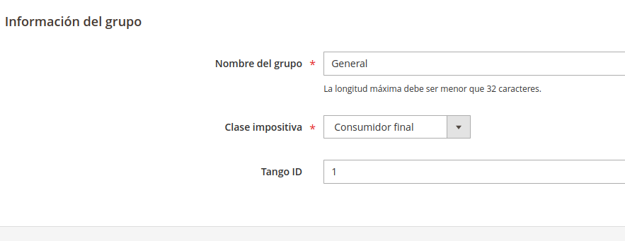

# Gento_TangoTiendas Magento 2 module

## Instalación

`$ composer require gento-arg/module-tango-tiendas`

`$ bin/magento module:enable Gento_TangoTiendas`

`$ bin/magento setup:upgrade`

## Configuración

En el menú de configuración, en la pestaña de `Servicios`, se agrega la sección `Tango Software`. Ahí se encuentran
todas las configuraciones necesarias.

### Credenciales

Al habilitarlo se muestran opciones adicionales de configuración. Dentro de estas opciones se encuentran los campos para
completar el API Token provisto por Tango desde [Nexo](https://nexo.axoft.com/).

Una vez ingresado el API Token, se puede probar la conexión presionando sobre el botón que dice `Test token`:

Luego de validar el token, se debe guardar la configuración para que se muestren las tiendas y los depósitos.

### Tiendas y depósitos

La configuración permite seleccionar la tienda de donde obtendrá los datos de stock y precio, y donde impactarán los
pedidos. Es requerido seleccionar ambos para poder utilizar la integración.

### Tareas programadas

Las tareas programadas permiten una importación asíncrona de stock y precio. Cada tarea se puede habilitar y configurar
de manera individual.

## Vinculación de productos

Para sincronizar los datos de stock y precio con Tango es necesario editar los productos y cargar el valor del
atributo `Tango SKU`. Se puede cargar directamente, o se puede optar por realizar una búsqueda haciendo clic
en `Buscar código tango`.

En la pantalla siguiente, se puede realizar una búsqueda parcial del código y se mostrarán los resultados.

Luego de buscar el código correcto, al hacer clic sobre seleccionar, el código se copia en el campo correspondiente para
evitar problemas de tipeo.

## Vinculación de grupos de clientes / listas de precio

En tango existen listas de precio y en magento existen grupos de clientes, la vinculación entre estos dos elementos
permite que se cargue el dato de precio para cada grupo de cliente. Dentro del formulario de configuración de grupos de
clientes hay un campo que permite esa vinculación.

## Pendientes

- Integración con MSI. En cada source debe configurarse el depósito en lugar de configurarse por tienda. Esto implica
  agregar la lógica de stock por depósito según corresponda en el cron.
- Mejor importación de precios por tienda: Los precios se importan en la configuración por defecto del producto, sin
  importar la configuración de token de donde provenga. Seria necesario importar el precio por defecto con el token que
  este configurado en el scope "por defecto" y los precios por cada tienda que dependan del token especifico.
- Cambiar la frecuencia de las tareas: Permitir importar varias veces en el dia el stock y precios. Muchas tiendas
  trabajan con diferentes puntos de venta haciendo que el stock no solo dependa de la tienda.
- Vincular grupos de clientes mediante api: Realizar una búsqueda que permita seleccionar un ID de grupo usando la
  búsqueda, similar a como se selecciona el Tango SKU en producto.
- Vincular clientes mediante api: Realizar una búsqueda que permita seleccionar un ID de cliente usando la búsqueda,
  similar a como se selecciona el Tango SKU en producto. 

